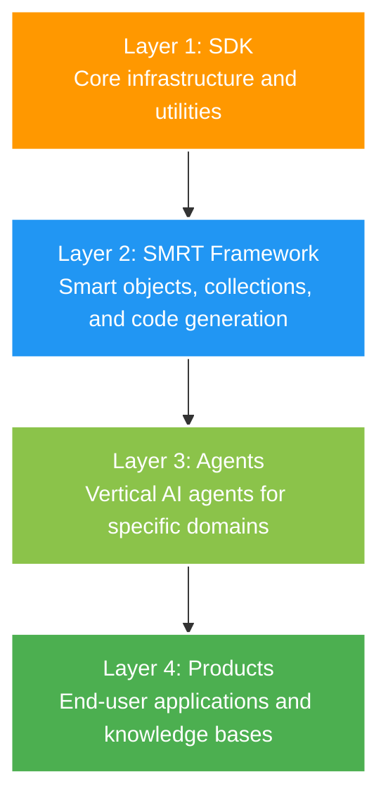

# Happy Vertical



## The SDK

A collection of TypeScript packages providing core infrastructure for AI and data-driven applications.

**Example: Using the AI package**

```typescript
import { AI } from '@happyvertical/ai';

const ai = new AI({
  provider: 'openai',
  apiKey: process.env.OPENAI_API_KEY,
});

const response = await ai.chat('Tell me a joke.');
console.log(response);
```

## The SMRT Framework

A TypeScript-first framework for building vertical AI agents with automatic code generation and database persistence.

**Example: Defining a SMRT Object**

```typescript
import { SmrtObject, SmrtCollection, smrt } from '@smrt/core';

@smrt({
  api: true, // Auto-generate REST API
  cli: true  // Auto-generate CLI
})
class Product extends SmrtObject {
  name: string = '';
  price: number = 0.0;
  quantity: number = 0;

  async analyze() {
    return await this.do('Analyze this product and suggest improvements');
  }
}

class ProductCollection extends SmrtCollection<Product> {
  static readonly _itemClass = Product;
}

// Setup and use
const products = await ProductCollection.create({
  persistence: { type: 'sql', url: 'products.db' }
});

const product = await products.create({ name: 'Smart Widget', price: 29.99, quantity: 100 });
await product.save();

const analysis = await product.analyze();
console.log(analysis);
```
